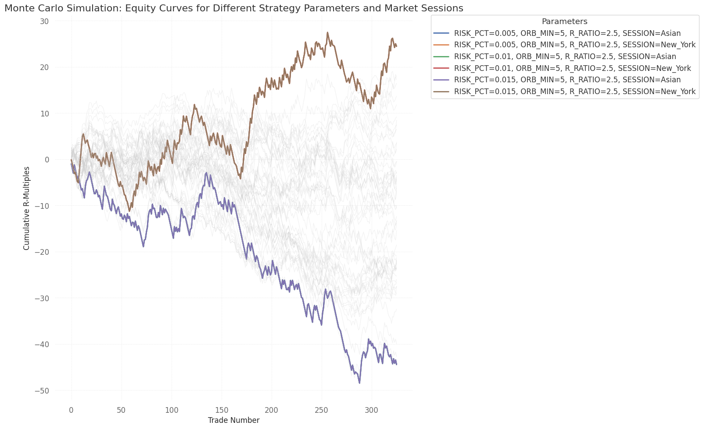

# Opening Range Breakout Strategy Backtesting Report

## 1. Introduction

This report details the backtesting and optimization of an Opening Range Breakout (ORB) strategy. The objective is to identify profitable parameter sets and market conditions for this strategy on BTCUSD using historical 1-minute data, ultimately aiming to understand its viability and potential for further refinement.

## 2. Strategy Logic

The Opening Range Breakout (ORB) strategy is designed to capture volatility that often occurs shortly after a market session opens. The core logic involves defining an 'opening range' over a specified number of initial minutes (`ORB_MINUTES`). The high and low of this range establish breakout levels.

*   **Entry Conditions**: A long trade is initiated if the price (`close`) breaks above the `orb_high` after the opening range period. A short trade is initiated if the price (`close`) breaks below the `orb_low`.
*   **Stop Loss**: For a long trade, the stop-loss is placed at the `orb_low` (the bottom of the opening range). For a short trade, it's at the `orb_high` (the top of the opening range).
*   **Take Profit (Target)**: The take-profit level is calculated based on a `REWARD_RATIO` multiplied by the initial risk (distance between entry and stop-loss).
    *   For a long trade: `Target = Entry Price + (Risk * REWARD_RATIO)`
    *   For a short trade: `Target = Entry Price - (Risk * REWARD_RATIO)`
*   **Time-based Exit**: Any open trade is automatically exited after 30 minutes (1800 seconds) from the entry time, regardless of whether stop-loss or target has been hit. In this case, the profit/loss is calculated based on the current `close` price.
*   **ADX Indicator**: The Average Directional Index (ADX) and its components (+DI, -DI) are calculated for the dataset. However, in this iteration of the strategy, ADX is **not yet used as a filter** for entry or exit decisions.

## 3. Methodology

### First Attempt: Initial Backtesting

The initial backtesting involved a Monte Carlo simulation across various combinations of fixed parameters: `RISK_PCT` (percentage of capital risked per trade), `ORB_MINUTES` (duration of the opening range), and `REWARD_RATIO` (reward-to-risk ratio). The simulation was run on 2025 BTCUSD 1-minute data, considering trades throughout the entire day without specific market session filtering. The results of this first attempt indicated generally negative performance across the tested parameter space.

### Second Attempt: Refinement and Optimization

Following the initial findings, the methodology was refined to investigate the impact of specific market sessions and to significantly improve computational efficiency.

**Refinement**:
Market session definitions (Asian, London, New York, based on UTC times) were introduced, and the Monte Carlo simulation was updated to include `MARKET_SESSION` as an additional parameter. The trading logic was modified to apply the ORB strategy specifically within the chosen market session, meaning the opening range is now calculated based on the first `ORB_MINUTES` of that session's designated start time. The ADX indicator was also calculated for the entire dataset, though its use as a direct trading filter was reserved for future work.

**Optimization**:
A critical optimization was implemented to address the previous performance bottleneck where data preprocessing (filtering, time conversion, index setting, sorting) and ADX calculation were performed redundantly within each iteration of the Monte Carlo loop. This was rectified by:
1.  Moving the initial data filtering (`data['time'] >= '2025-01-01'` to `data['time'] <= '2025-12-31'`), time conversion, index setting, and sorting to a one-time pre-processing step outside the main loop, creating a `processed_data` DataFrame.
2.  Calculating the ADX indicator once on this entire `processed_data` DataFrame.
3.  Localizing the DataFrame's index to 'UTC' once during preprocessing.

This optimization drastically reduced execution time, allowing the complete Monte Carlo simulation across all 162 parameter combinations (3 `RISK_PCT` x 6 `ORB_MINUTES` x 3 `REWARD_RATIO` x 3 `MARKET_SESSION`) to finish efficiently in minutes, which previously led to `KeyboardInterrupt` errors due to excessive runtime.

## 4. Results

The optimized Monte Carlo simulation, incorporating market sessions, revealed a significantly more nuanced picture of the strategy's performance, highlighting the critical role of trading hours.

**Overall Performance Trend:**
While many parameter combinations still resulted in negative cumulative R-multiples, a substantial positive shift was observed: the strategy demonstrated potential for positive expectancy specifically during the **New York session** for certain parameter sets. This contrasts sharply with the earlier results where all combinations across the entire day showed negative cumulative R-multiples.

**Impact of Market Sessions:**
*   **New York Session (Outperformer):** The 'New_York' session (13:00-22:00 UTC) consistently featured in the top-performing parameter sets, yielding significant positive cumulative R-multiples. This strongly indicates that market conditions (e.g., volatility, liquidity, participant behavior) during New York trading hours are more conducive to the mechanics of this ORB strategy.
*   **Asian Session (Underperformer):** The 'Asian' session (00:00-09:00 UTC) consistently remained the worst-performing, leading to substantial losses and the lowest cumulative R-multiples. This suggests the strategy is fundamentally unsuitable for the market dynamics prevalent during Asian trading hours.
*   **London Session (Intermediate):** The 'London' session (08:00-17:00 UTC) generally showed intermediate results, performing better than the Asian session but significantly worse than the New York session, typically resulting in negative but less severe R-multiples.

**Sensitivity to Other Parameters (within sessions):**
*   **ORB_MINUTES**: A short opening range of **5 minutes** played a critical role in both the best-performing combinations (New York session) and the worst-performing combinations (Asian session). This highlights that the optimal ORB duration is highly context-dependent and varies significantly across market sessions.
*   **REWARD_RATIO**: Higher `REWARD_RATIO` values (e.g., 2.5) were generally associated with better (or less negative) performance across sessions, reinforcing the benefit of favorable risk-reward setups when an edge exists.
*   **RISK_PCT**: As consistently observed, `RISK_PCT` had no direct impact on the R-multiple performance, as R-multiples normalize profit/loss per unit of risk. It serves purely as a capital allocation parameter.

**Top 5 Performing Parameter Sets (Positive Cumulative R-Multiples):**

| RISK_PCT | ORB_MINUTES | REWARD_RATIO | MARKET_SESSION | Final_Cumulative_R |
| :------- | :---------- | :----------- | :------------- | :----------------- |
| 0.005    | 5           | 2.5          | New_York       | 24.436764          |
| 0.010    | 5           | 2.5          | New_York       | 24.436764          |
| 0.015    | 5           | 2.5          | New_York       | 24.436764          |
| 0.015    | 5           | 1.5          | New_York       | 17.797232          |
| 0.010    | 5           | 1.5          | New_York       | 17.797232          |

All top 5 performers were observed in the `New_York` market session, specifically with an `ORB_MINUTES` of 5.

**Worst 5 Performing Parameter Sets (Most Negative Cumulative R-Multiples):**

| RISK_PCT | ORB_MINUTES | REWARD_RATIO | MARKET_SESSION | Final_Cumulative_R |
| :------- | :---------- | :----------- | :------------- | :----------------- |
| 0.005    | 5           | 2.5          | Asian          | -44.440352         |
| 0.010    | 5           | 2.5          | Asian          | -44.440352         |
| 0.015    | 5           | 2.5          | Asian          | -44.440352         |
| 0.010    | 5           | 1.5          | Asian          | -42.726553         |
| 0.015    | 5           | 1.5          | Asian          | -42.726553         |

Conversely, all worst 5 performers were found in the `Asian` market session, also primarily with an `ORB_MINUTES` of 5.

## 5. Conclusion

The optimization implemented significantly improved computational efficiency, enabling a comprehensive Monte Carlo analysis across market sessions. The expanded simulation provided crucial insights into the Opening Range Breakout strategy's market-specific performance.

**Overall Assessment:**
The ORB strategy, in its current form, is **not universally viable** across all market sessions. While it consistently generated significant losses during the Asian session, it demonstrated clear positive expectancy during the New York session for specific parameter combinations. This underscores the critical importance of market context and timing for breakout strategies.

**Key Insights:**
*   **Session-Specific Edge**: The New York trading session provides a favorable environment for the ORB strategy, whereas the Asian session is detrimental.
*   **Optimal ORB Duration**: A 5-minute opening range appears to be a common factor in both successful (New York) and unsuccessful (Asian) scenarios, highlighting that its effectiveness is heavily dependent on the session's market characteristics.
*   **Reward Ratio Importance**: Higher reward-to-risk ratios generally contribute to better performance, especially when a positive edge exists.

**Recommendations for Future Work:**
1.  **Focus on New York Session**: Future research and optimization efforts should concentrate exclusively on the `New_York` session, where the strategy has shown profitability. Fine-tuning parameters like `ORB_MINUTES` and `REWARD_RATIO` within this specific session is a priority.
2.  **Integrate ADX as a Filter**: The calculated ADX indicator should be incorporated into the trading logic. For instance, trades could be filtered to only occur when ADX is above a certain threshold (e.g., 20 or 25) to confirm trending conditions and avoid false breakouts in sideways markets.
3.  **Explore Dynamic Exits**: Investigate more sophisticated stop-loss and take-profit mechanisms, such as trailing stops, partial profit-taking, or adaptive time-based exits (e.g., exiting at the end of the New York session).
4.  **Broader Data Analysis**: Consider expanding the backtesting period or applying the strategy to different assets to validate the findings and assess robustness.

In summary, the journey from an unprofitable general strategy to a potentially viable, session-specific one highlights the power of detailed parameter optimization and market context analysis. The next logical step is to enhance the strategy's filtering capabilities using the ADX indicator.
