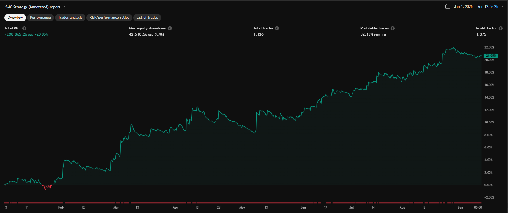
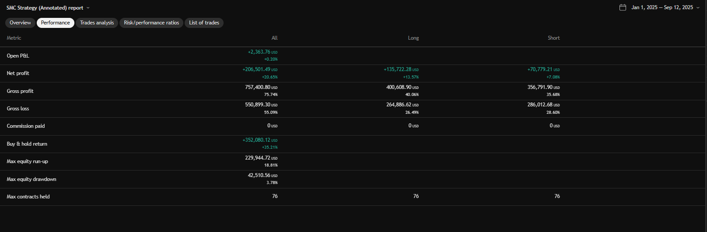
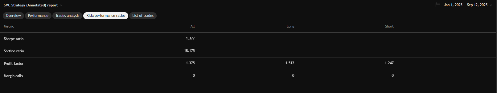
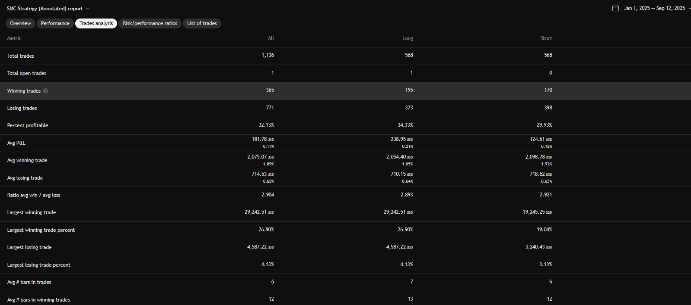

# SMC Strategy – Quantitative Research Report

## 1. Introduction

This project analyzes an automated trading strategy based on **Smart Money Concepts (SMC)**.  
It is designed as a **dual-speed momentum system** operating on a "stop-and-reverse" (SAR) basis.  
The strategy seeks to identify **Break of Structure (BOS)** and **Change of Character (CHoCH)** events, automating entries and exits to systematically capture market trends.

Key Highlights:
- Focused on **ETH/USD, 1H timeframe**
- Dual SMA crossover system (10 & 20-period) as a proxy for BOS/CHoCH
- Always-in-market, momentum-following approach
- Optimized for strong-trending assets

See more in my post: [TradingView Pine Script Docs](https://www.tradingview.com/script/tGF0BYtp-SMC-Strategy/)  

## 2. Smart Money Concepts Overview

- **Break of Structure (BOS):** Indicates trend continuation after breaking a major swing high/low.
- **Change of Character (CHoCH):** First sign of potential trend reversal when price breaks recent minor structure.

The SMA crossover acts as a **practical proxy** for these events:
- BOS ⇔ momentum continuation confirmation
- CHoCH ⇔ shift in market structure (momentum reversal)

## 3. Key Assumptions

- **SMA crossover ≈ structural break**
- Simplifies manual SMC detection → suitable for automation
- Acknowledged limitation: SMA is **lagging**, may give delayed exits/entries

## 4. Results and Analysis

ETH/USD 1H Backtest Findings:
- Strong performance in trending conditions
- Captures large directional swings
- Suffers from whipsaws in choppy markets

## 5. Research Showcase

### Candlestick-Based Backtest

<b>Overview</b>

<b>Performance</b>

<b>Risk / Return Ratios</b>

<b>Trade Analysis</b>

---

### Heikin Ashi-Based Backtest

<b>Overview</b>

<b>Performance</b>

<b>Risk / Return Ratios</b>

<b>Trade Analysis</b>

## 6. References

[Smart Money Concept (LuxAlgo)](https://www.tradingview.com/v/CnB3fSph/)  

## 7. Note

This project demonstrates:
- Ability to translate market theory (SMC) into **systematic strategy code**
- Skilled use of **quantitative backtesting, performance evaluation, and risk analysis**
- Clear documentation for reproducibility and professional review

## Disclaimer

This project is for educational and research purposes only.  
Past performance does not guarantee future results.
